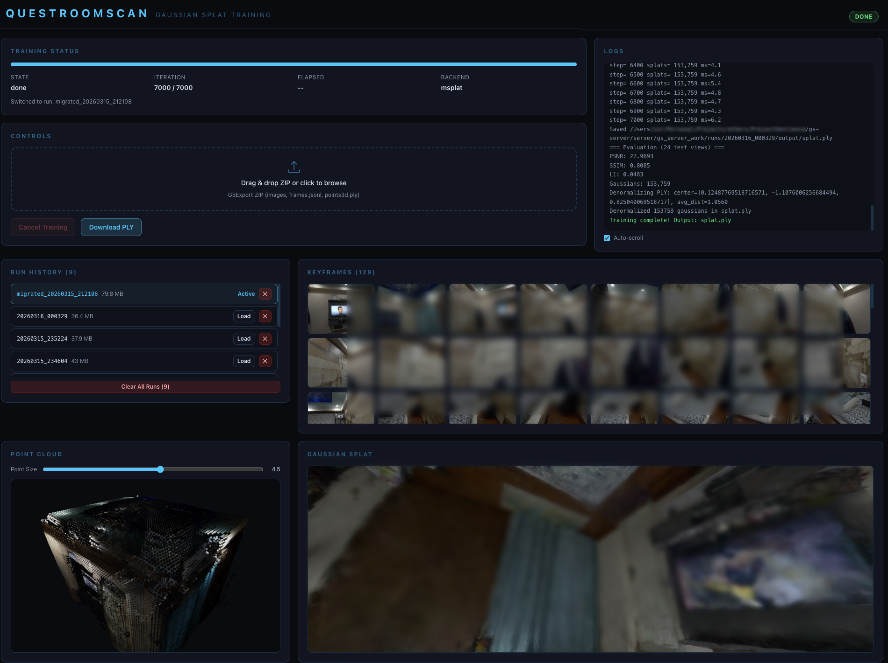

# RoomScan-GaussianSplatServer

PC training server + web dashboard for [QuestRoomScan](https://github.com/arghyasur1991/QuestRoomScan) Gaussian Splatting pipeline, with server-side atlas enhancement and mesh enhancement.

## Overview

Receives captured keyframes and point cloud from a Meta Quest headset, runs COLMAP conversion + Gaussian Splat training, and serves the trained model back. Includes a real-time web dashboard for monitoring training, browsing keyframes, and interactively viewing point clouds and trained splats.

Additionally provides:

- **Atlas Enhancement API** (`/enhance-atlas`) — Takes a refined texture atlas PNG, applies Real-ESRGAN super-resolution (2x/4x) + LaMa inpainting, and returns the enhanced atlas. Used by QuestRoomScan's HQ Refine feature.
- **Mesh Enhancement API** (`/enhance-mesh`) — Takes a binary mesh (Unity's refined mesh format), applies bilateral normal-guided smoothing + optional RANSAC plane detection and vertex snapping, and returns the enhanced mesh.
- **Atlas Inpainting API** (`/inpaint-atlas`) — Standalone endpoint for LaMa/OpenCV inpainting of atlas textures.
- **Texture Refinement API** (`/refine-texture`) — Experimental multi-view texture optimization via PyTorch (MPS/CUDA/CPU). Superseded by on-device refinement in QuestRoomScan.



## Quick Start

```bash
# Install Python dependencies
cd server
pip install -r requirements.txt

# Start the backend server
python main.py --port 8420

# In a second terminal, start the web dashboard
cd web
npm install
npm run dev
# Dashboard at http://localhost:5173

# Production (single process — serves built frontend from backend)
cd web && npm run build
cd ../server && python main.py --port 8420
# Dashboard at http://localhost:8420
```

The Quest app connects to the server automatically (configure the server IP in the Quest app's debug menu or via the RoomScan Setup Wizard). The server listens on `0.0.0.0:8420` by default.

## Architecture

```
Quest 3                          PC Server                         Web Dashboard
────────                         ─────────                         ─────────────
KeyframeCollector ─┐
                   ├─ ZIP ──POST /upload──► TrainingManager         React + Vite
PointCloudExporter ─┘                          │                    + Tailwind CSS
                                    ┌──────────┴──────────┐
                                    ▼                     ▼
                              COLMAP Convert        Scene Normalization
                              (frames.jsonl →       (camera center + avg
                               cameras.bin,          distance → scene_norm.json)
                               images.bin,
                               points3D.bin)
                                    │
                                    ▼
                              GS Training (msplat / gsplat / 3DGS)
                                    │
                              ┌─────┴─────┐
                              ▼           ▼
                         splat.ply    Denormalize PLY
                                    (reverse scene norm →
                                     world coordinates)
                                          │
GSplatManager ◄──GET /download────────────┘
      │                                         WebSocket /ws/status ──► TrainingStatus
      ▼                                         SSE /api/logs ────────► LogPanel
GaussianSplatPlyLoader                          GET /api/keyframes ───► KeyframeBrowser
      │                                         GET /api/pointcloud ──► PointCloudViewer
      ▼                                         GET /api/splat ───────► SplatViewer
GaussianSplatRenderer (UGS)

RoomScanner ──POST /enhance-atlas──► atlas_enhance.py (Real-ESRGAN SR → LaMa inpaint)
           ──POST /enhance-mesh───► mesh_enhance.py (bilateral smooth → plane snap)
```

### Stack

- **Backend**: FastAPI (Python) — REST API + WebSocket + SSE
- **Frontend**: React 19 + Vite + TypeScript + Tailwind CSS
- **3D Rendering**: Three.js / @react-three/fiber (point cloud) + @mkkellogg/gaussian-splats-3d (trained splat)
- **Training**: msplat (Metal/Apple Silicon), gsplat (CUDA), or original 3DGS
- **Atlas Enhancement**: Real-ESRGAN (super-resolution), LaMa (inpainting), OpenCV (fallback)
- **Mesh Enhancement**: NumPy/SciPy (bilateral normal filter, RANSAC plane detection)

## API Reference

### Quest Endpoints

These are called by the Quest app's `GSplatServerClient`:

| Method | Path | Description |
|--------|------|-------------|
| `POST` | `/upload` | Upload ZIP of keyframes + point cloud; starts COLMAP conversion + training |
| `GET` | `/status` | Training status JSON (`{state, iteration, total_iterations, elapsed}`) |
| `GET` | `/download` | Download trained `splat.ply` (denormalized to world coordinates) |
| `POST` | `/cancel` | Cancel in-progress training |

### Atlas & Mesh Enhancement Endpoints

| Method | Path | Description |
|--------|------|-------------|
| `POST` | `/enhance-atlas?scale=2&inpaint=true` | Upload atlas PNG; returns SR-enhanced + inpainted atlas PNG. `scale`: 2 or 4 (Real-ESRGAN). `inpaint`: apply LaMa after SR. |
| `POST` | `/enhance-mesh` | Upload binary mesh (Unity format); returns enhanced mesh with bilateral smoothing + plane snapping |
| `POST` | `/inpaint-atlas` | Upload atlas PNG; returns inpainted atlas (LaMa or OpenCV fallback) |

### Texture Refinement Endpoints (experimental)

| Method | Path | Description |
|--------|------|-------------|
| `POST` | `/refine-texture?steps=N` | Upload ZIP of UV mesh + keyframes; starts async multi-view texture optimization |
| `GET` | `/refine-texture/status` | Poll refinement progress (`{state, progress, message}`) |
| `GET` | `/refine-texture/result` | Download the optimized atlas PNG when refinement is done |

Refinement runs are persisted in `gs_server_work/refine_runs/` (up to 10, oldest auto-cleaned).

### Dashboard Endpoints

| Method | Path | Description |
|--------|------|-------------|
| `GET` | `/api/status` | Extended status with iteration count, elapsed time, run info |
| `GET` | `/api/runs` | List all training runs (timestamped directories) |
| `POST` | `/api/runs/{name}/activate` | Switch active run (re-symlinks `current_run`) |
| `DELETE` | `/api/runs/{name}` | Delete a specific training run |
| `DELETE` | `/api/runs` | Delete all training runs |
| `GET` | `/api/keyframes` | List keyframe metadata for the active run |
| `GET` | `/api/keyframes/{id}/image` | Serve keyframe JPEG |
| `GET` | `/api/pointcloud` | Serve `points3d.ply` for the active run |
| `GET` | `/api/renders` | List intermediate render images |
| `GET` | `/api/renders/{filename}` | Serve a specific render image |
| `GET,HEAD` | `/api/splat` | Serve trained splat PLY (streaming) |
| `GET,HEAD` | `/api/splat/full` | Serve full trained splat PLY |
| `GET` | `/api/logs` | SSE stream of training logs (real-time) |
| `WS` | `/ws/status` | WebSocket for real-time training status push |

## Training Pipeline Detail

### 1. COLMAP Conversion (`gs_pipeline.py`)

Converts Quest capture data to COLMAP format:

- **Input**: `frames.jsonl` (poses + intrinsics) + JPEG keyframes + `points3d.ply`
- **Coordinate transform**: Unity (left-handed Y-up) → COLMAP (right-handed Y-down)
  - Positions: negate Y
  - Rotations: `flip @ R_unity @ flip` where `flip = diag(1, -1, 1)`
- **Camera model**: Single PINHOLE with principal point crop adjustment
- **Output**: `cameras.bin`, `images.bin`, `points3D.bin`

### 2. Scene Normalization

Computed during COLMAP conversion and saved to `scene_norm.json`:

- **Center**: Mean of all camera positions in COLMAP space
- **Scale**: `1 / avg_distance_from_center`

Training backends (especially msplat/nerfstudio) internally normalize the scene to a unit cube. The normalization parameters are saved so the output can be denormalized.

### 3. Training

Auto-detects the best available backend:

| Backend | Platform | Detection |
|---------|----------|-----------|
| msplat | Apple Silicon (Metal) | `python -c "import msplat"` |
| gsplat | NVIDIA GPU (CUDA) | `python -c "import gsplat"` |
| 3DGS | NVIDIA GPU (CUDA) | `--gs-repo` argument |

Default: 7,000 iterations (configurable via `--iterations` flag).

### 4. Denormalization

After training, the output `splat.ply` is in normalized space. `denormalize_ply()` reverses the transformation:

- **Positions**: `P_world = P_normalized * avg_dist + center`
- **Scales** (log-space): `s_world = s_normalized + ln(avg_dist)`

The downloaded PLY is in COLMAP world coordinates — the Quest client applies the final COLMAP→Unity conversion during rendering.

### 5. Run Management

Each upload creates a timestamped directory (`YYYYMMDD_HHMMSS`). A `current_run` symlink always points to the active run. The dashboard can browse, activate, and delete past runs.

## Web Dashboard

The dashboard (`http://localhost:5173` in dev, `http://localhost:8420` in production) provides:

- **Training Status**: Real-time state, iteration progress, elapsed time (via WebSocket)
- **Training Controls**: Upload ZIP (drag-and-drop), cancel training
- **Log Panel**: Live training logs via SSE (auto-scrolling, contained)
- **Keyframe Browser**: Grid of captured keyframes with metadata
- **Point Cloud Viewer**: Interactive 3D viewer with orbit controls (Three.js)
- **Splat Viewer**: Trained Gaussian Splat viewer (@mkkellogg/gaussian-splats-3d)
- **Run History**: Browse, activate, and delete past training runs

## Configuration

```bash
python main.py --help

  --port PORT          Server port (default: 8420)
  --host HOST          Bind address (default: 0.0.0.0)
  --iterations N       Training iterations (default: 7000)
  --work-dir DIR       Working directory for training data (default: gs_server_work)
```

## Network Setup (Quest → PC)

The Quest app needs HTTP access to the PC server. For local network:

1. The **RoomScan Setup Wizard** auto-configures Android cleartext HTTP traffic and network security settings
2. Server URL is auto-detected from the PC's local IP during wizard setup
3. The server URL can also be manually set in the Quest app's debug menu

## License

[MIT](../LICENSE.md)
